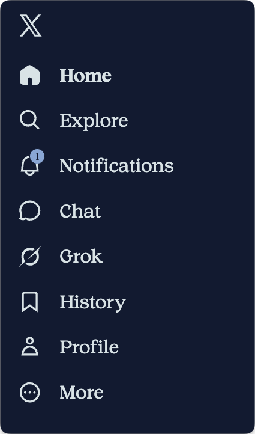

# Minimal Midnight For X (twitter)

An independent, open-source Chrome extension that gives x.com a quiet Midnight palette and optional layout controls. Choose Readex Pro, Calibri, or Convection in the extension popup. Readex Pro is bundled and works offline. Calibri and Convection use fonts already installed on your device; if either is absent, the page falls back to Readex Pro.

This project is not affiliated with X, Google, or Typefully. It includes no proprietary font files.

## Screenshots

These are signed-in X screenshots captured with the local extension. The framing excludes the account owner's username. The public extension uses the same colors and layout; its available fonts differ as described above.

### Home sidebar

### Complete posts

[OpenAI post](https://x.com/OpenAI/status/2100679996633452747) · English

[Salla post](https://x.com/SallaApp/status/2099087474400084290) · Arabic

### Bookmark confirmation

## Install from source

1. Open `chrome://extensions` in Chrome and enable **Developer mode**.
2. Click **Load unpacked** and select this repository's root folder.
3. Reload any open x.com tabs.
4. Open the extension popup to choose a font and adjust the layout.

The extension runs only on `x.com` and `www.x.com`. Its only requested permission is `storage`, used for preferences. It does not collect posts, messages, account details, or browsing history for the developer. See [Privacy](PRIVACY.md) for the exact storage behavior.

If you also use another X styling extension, disable one of them to avoid conflicting styles.

## Fonts and licenses

Readex Pro is from the [Google Fonts repository](https://github.com/google/fonts/tree/main/ofl/readexpro) under the SIL Open Font License 1.1, included in [`licenses/ReadexPro-OFL.txt`](licenses/ReadexPro-OFL.txt). Calibri and Convection are not included or redistributed. The layout work includes adaptations of [Minimal Theme for Twitter / X](https://github.com/typefully/minimal-twitter), which is MIT licensed; its notice is preserved in [`licenses/Minimal-Theme-MIT.txt`](licenses/Minimal-Theme-MIT.txt). See [third-party notices](THIRD_PARTY_NOTICES.md).

The original code in this repository is licensed under MIT. Third-party fonts and code retain their own licenses.

## Development

This extension uses Manifest V3 and has no build step. After editing source files, click **Reload** on its card at `chrome://extensions`, then reload x.com. Keep `manifest.json` at the root of the extension folder.

X changes its markup frequently. If a selector stops matching, open an issue with the affected page and a screenshot that contains no private information.
